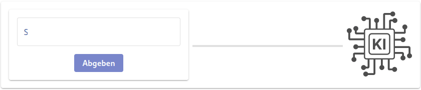

<div align="center">


# Feedbacksystem

[](https://opensource.org/licenses/Apache-2.0)

[](https://artifacthub.io/packages/helm/thm-mni-ii/feedbacksystem)
[](https://github.com/thm-mni-ii/feedbacksystem/actions/workflows/ci.yml)
[](https://codecov.io/gh/thm-mni-ii/feedbacksystem)

</div>

Intelligent, personalized feedback for students using artificial intelligence



## Table of Contents

- [Table of Contents](#table-of-contents)
- [Security](#security)
  - [Vulnerabilities](#vulnerabilities)
- [Background](#background)
- [Install](#install)
  - [Development](#development)
  - [Production](#production)
- [API](#api)
- [License](#license)

## Security

### Vulnerabilities

If you find a vulnerability in this system, please report it at the following url:

[https://github.com/thm-mni-ii/feedbacksystem/security/advisories/new](https://github.com/thm-mni-ii/feedbacksystem/security/advisories/new)

## Background

As a student you have to submit a lot of tasks for your lectures. Usually the only reply you get is that you passed or failed. This is a situation we want to change. Feedbacksystem is an application to automatically check your submissions and give an immediate result. With the result we want to provide suggestions to the students about their mistakes, collect the most common mistakes and present them to the lecturers such that they can address them in the lectures.

## Install

### Development

The following software is required for the development:
    
- Java (Version 11)
- Docker
- Git

Clone this Repository to your locale Directory
```
git clone git@github.com:thm-mni-ii/feedbacksystem.git
```

Change to the cloned directory
```
cd feedbacksystem
```

Build all container an start them with `docker compose`
```
docker compose up -d --build
```

The System can now be accessed at `https://localhost`.

#### Frontend

For frontend development the following software is needed:

- node
- npm

Change to the Directory of the frontend code
```
cd modules/fbs-core/web
```

Install neccessary npm packages and start the dev-server
```
npm i
npm run start
```

### Production

#### Requirements

* A Kubernetes Cluster
* [kubectl](https://kubernetes.io/docs/tasks/tools/)
* [helm](https://helm.sh/docs/intro/install/)
* [deno](https://deno.land/manual/getting_started/installation)

#### Steps

1. Ensure the requirements are met
3. Generate values 
```
deno run --reload=https://raw.githubusercontent.com https://raw.githubusercontent.com/thm-mni-ii/helm-charts/main/charts/feedbacksystem/generate-values.ts --allow-write=vals.yaml vals.yaml
```
4. Add the helm repository 
```
helm repo add thm-mni-ii https://thm-mni-ii.github.io/helm-charts
```
5. Install 
```
helm install -n <namepsace> --create-namespace --wait -f vals.yaml fbs thm-mni-ii/feedbackssystem
```

## API

The specification of the interfaces of the feedbacksystem can be found [here](https://thm-mni-ii.github.io/feedbacksystem/api-docs/).

## License

[Apache-2.0 © 2023 Technischen Hochschule Mittelhessen](LICENSE)
